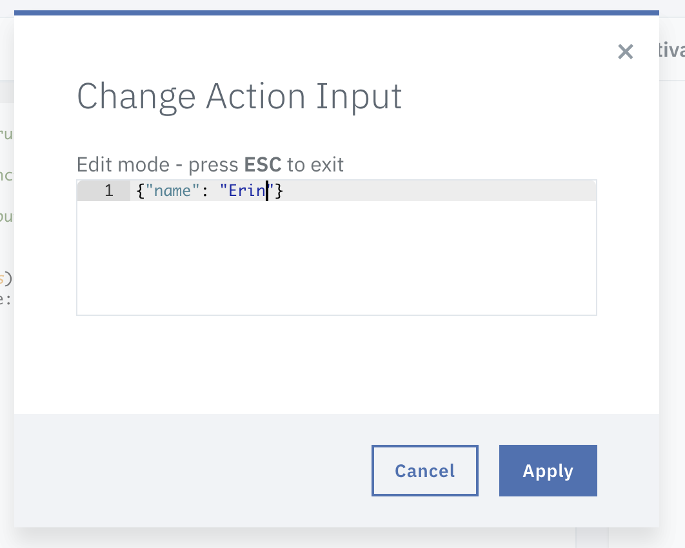
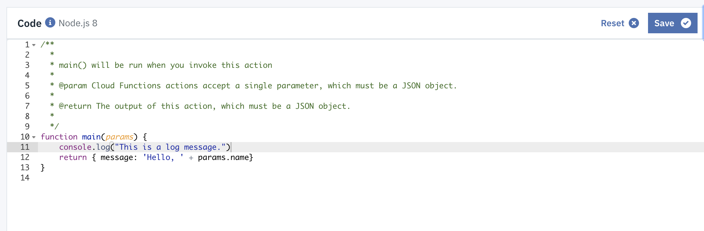

# serverless-for-managers-lab
Lab instructions for serverless lab (originally THINK 2018 Lab 5790A)

Looking for the PDF of the talk itself? It's [here](/ServerlessForManagers-THINK2018-McKean.pdf).

## Goal
In this lab, you will:
	
	* Create a serverless function
	* Check your function's logs
	* Delete or suspend your function

### Prerequisites

You need an IBM Cloud account! Sign up for one with this link [https://ibm.biz/BdZTG4](https://ibm.biz/BdZTG4).


### Instructions

#### Signing in: 

1. Visit [https://www.ibm.com/cloud/](https://www.ibm.com/cloud/) in your browser.

2. Click on the "person" icon in the upper-right-hand corner:


3. Choose "sign in" from the drop-down menu: 

4. Enter the IBM Student Cloud login email and click 'Continue'. 
5. Enter the password that you were given when you entered the lab and click "Sign in".  

6. Click on "My cloud console" and choose "Dashboard": 

#### Creating a Function

1. Find the menu in the upper left-hand corner: 
2. Click on the menu and choose "Functions": 
3. Click the "Start Creating" button: 
4. Choose "Create Action": 
5. Give your action a name:  and click the "Create" button.
6. See your code! 
7. Invoke your code by clicking the "Invoke" buttom: 
*NOTE: if you get a "Not found" message, add a blank line at the end of your code block, save, and invoke again.*
8. Check out the results of your activation! 

#### Using an Input Parameter

Cloud functions accept a single parameter, a JSON object called `params` in our function here. 

Update your function code to say "Hello " and your name by changing line 11 to read: 

`return { message: 'Hello, ' + params.name}`

Then click on "Change Input" in the function header: 


And enter your name as a parameter called `name`:

````json
{"name": "Erin"}
````


Click "Apply".

Click "Invoke" again and you should see an output that looks like this: 


#### Adding Logs

You can add logging statements to your function very simply. To test this, add `console.log("This is a log message.")` to your function: 



Save and Invoke your function and you should see this output: 


Note that the timestamp and the type of log (`stdout`) are included automatically.

You can see full Kibana logs for all your function invocations by clicking "Logs" in the sidebar: 


This will take you to a full Kibana dashboard (it make take a minute or so to load): 


#### Adding a Web Endpoint

It's very simple to make your function a public web endpoint! 

From the Action sidebar, click on Endpoints: 


Click "Enable as Web Action" and Save: 


Copy and paste the string under "URL" by clicking on the copy icon:


Open a new tab in your browser, and paste in your url. You should see something like this: 


You won't see your name, because you didn't pass a parameter called `name` to your function. 

Add `?name=Erin` (or your name, of course) to the end of your URL and refresh. Your output should now include your name: 


#### Deleting Your Function

Navigate to the Actions overview dashboard and choose 'Delete Action' from the dropdown menu: 


