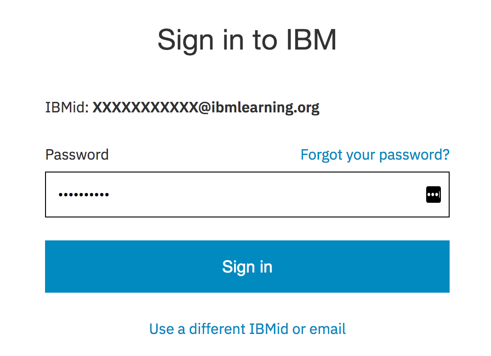
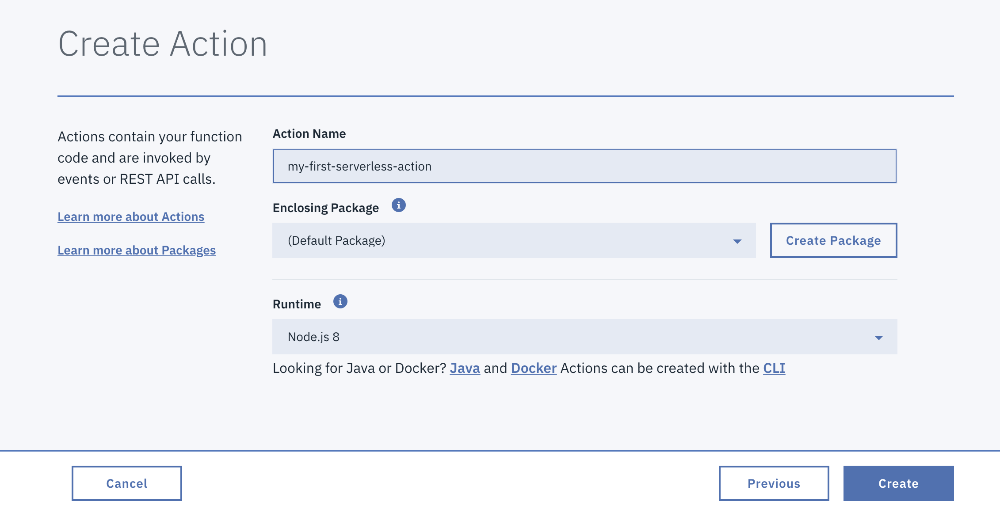
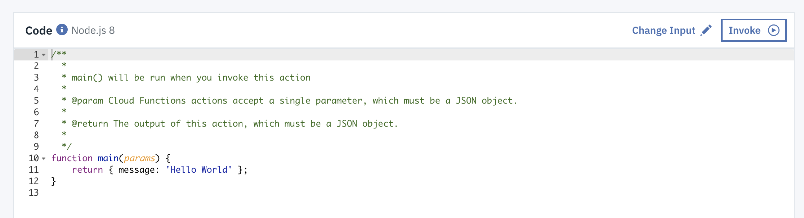

# serverless-for-managers-lab
Lab instructions for THINK Lab 5790A 2018

##Goal
In this lab, you will:
	
	* Create a serverless function
	* Schedule a trigger for your function
	* Check your function's logs
	* Delete or suspend your function

### Prerequisites

You should have received a student IBM Cloud login upon entering the lab room. (You will have had to sign a release form to receive the login ID.)
	IF YOU DID NOT RECEIVE AN ID PLEASE ASK THE INSTRUCTOR FOR ONE. 
 >NOTE:  These IDs will be deactivated after THINK so if you want to continue to experiment with IBM Cloud or save you work, you should get own IBM Cloud ID [here](link TK).  

### Instructions

####Signing in: 

1. Visit [https://www.ibm.com/cloud/](https://www.ibm.com/cloud/) in your browser.

2. Click on the "person" icon in the upper-right-hand corner:

3. Choose "sign in" from the drop-down menu: 

4. Enter the IBM Student Cloud login email and click 'Continue'. 
5. Enter the password that you were given when you entered the lab and click "Sign in".  

6. Click on "My cloud console" and choose "Dashboard": 

####Creating a Function

1. Find the menu in the upper left-hand corner: 
2. Click on the menu and choose "Functions": 
3. Click the "Start Creating" button: 
4. Choose "Create Action": 
5. Give your action a name:  and click the "Create" button.
6. See your code! 
7. Invoke your code by clicking the "Invoke" buttom: 
*NOTE: if you get a "Not found" message, add a blank line at the end of your code block, save, and invoke again.*
8. Check out the results of your activation! 

####Using an Input Parameter

####Checking Logs

####Adding a Trigger

####Deleting Your Function

